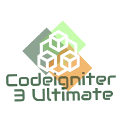

<!-- PROJECT SHIELDS -->
<!--
*** I'm using markdown "reference style" links for readability.
*** Reference links are enclosed in brackets [ ] instead of parentheses ( ).
*** See the bottom of this document for the declaration of the reference variables
*** for contributors-url, forks-url, etc. This is an optional, concise syntax you may use.
*** https://www.markdownguide.org/basic-syntax/#reference-style-links
-->
<!--
Todo: Add project badges here
-->

<!-- PROJECT LOGO -->
<br />
<p align="center">
  <a href="https://github.com/cocoytech/codeigniter-iii-ultimate">
    
  </a>

  <h3 align="center">CodeIgniter 3 Ultimate</h3>

  <p align="center">
   The aim of this project is to get the best practices and setup for startup project using CI3. Combine the library creation, blogs and articles related to CodeIgniter 3.
    <br />
    <a href="https://github.com/cocoytech/codeigniter-iii-ultimate/docs"><strong>Explore the docs »</strong></a>
    <br />
    <br />
    <a href="#">View Demo </a><b><i>(soon)</i></b> <!-- https://ci3ultimate.cocoytech.com/ -->
    ·
    <a href="https://github.com/cocoytech/codeigniter-iii-ultimate/issues">Report Bug</a>
    ·
    <a href="https://github.com/cocoytech/codeigniter-iii-ultimate/issues">Request Feature</a>
  </p>
</p>


<!-- TABLE OF CONTENTS -->
## Table of Contents
* [Features](#features)
* [Getting Started](#getting-started)
  * [Prerequisites](#prerequisites)
  * [Installing](#installing)
  * [Developing](#developing)
  * [Running tests](#running-tests)
  * [Installation](#installation)
  * [Building](#building)
  * [Deploying](#deploying)
  * [Release](#release)
* [Support](#support)
* [Built With](#built-with)
* [Acknowledgements and Contributing](#acknowledgements-and-contributing)
* [License](#license)


## Features
- Use Composer setup and proper format of package __psr1__
- Follow the GitHub community standard repository for open-source
<!--
Todo: Insert table with images about the feature of the project
-->


## Getting Started


<!--
Todo: Add link to the products need in the things to be install
-->
### Prerequisites
* Web browser (better using Chrome or Firefox)
* PHP 5.6 Upward (Apache Server like XAMPP/WAMPP/LAMPP)
* PHPUnit
* XDebug (Optional)
* SSH ready device (Secured connection and dev environment for restricted network setup or office)
* Editor or IDE (VSCode/Netbeans/Phpstorm)
* Docker Setup (Optional)
* Linux or macOS or Windows
* Bash for Windows (`git bash` should suffice)


### Installing

```git
Clone the project
```
<!--
Todo: Composer install
Todo: Docker yaml install
-->

### Developing
<!--
Todo: Proper clone the project
Todo: Add motivation and example from wikis of the development like blogs and articles
-->
[(Back to top)](#table-of-contents)

### Running Tests

``` bash
$ cd /path/to/codeigniter/
$ cd bin/
$ phpunit
```
*Output example*
```
Time: 341 ms, Memory: 5.50Mb

OK (3 tests, 3 assertions)

Generating code coverage report in Clover XML format ... done

Generating code coverage report in HTML format ... done
```

[(Back to top)](#table-of-contents)

### Building
<!--
Todo: explain about it will not build but the modules should be rund like composer and docker
-->
[(Back to top)](#table-of-contents)

### Deploying
<!--
Todo: CICD from Azure
Todo: CICD from Jenkin
Todo: CICD from Travis CI
Todo: CICD from Circle CI
-->
[(Back to top)](#table-of-contents)


### Release
<!--
Todo: Add roadmap link project
Todo: Add changelog link
Todo: release policy link
-->
We use [SemVer](http://semver.org/) for versioning. For the versions available, see the [tags on this repository](https://github.com/your/project/tags).

[(Back to top)](#table-of-contents)


## Support

<!--a href="https://www.buymeacoffee.com/5Zn8Xh3l9" target="_blank"></a-->
<!-- Todo: Add Buy me a coffee -->

<p>Or</p>
<!-- Todo: Add patreon donation -->
<!--a href="https://www.patreon.com/amitmerchant">
	
</a-->

Support this project and others by <!-- Todo: Add paypal donation -->

## Built With
* [Maven](https://maven.apache.org/) - Dependency Management
* [ROME](https://rometools.github.io/rome/) - Used to generate RSS Feeds

[(Back to top)](#table-of-contents)


## Links
<!--


- Email address
- Google Group/mailing list (if applicable)
- IRC or Slack (if applicable)
-->
- **Roadmap** of planned features can be found [here](#). Suggestions are welcome


[(Back to top)](#table-of-contents)

## Acknowledgements and Contributing
<!--
Include a section for credits in order to highlight and link to the authors of your project.
- You should probably resize their picture using `?s=200` at the end of the image URL.
Todo: Inspiration link
-->

* Hat tip to anyone whose code was used
* etc See also the list of [contributors](contributors.md) who participated in this project.

We love contributions! Check out the [Contribution guide](CONTRIBUTING.md) for more information. Simplest and really helpful for the community would be contribution meta information to our [supported libraries list](https://github.com/sourcerer-io/awesome-libraries).

1. Fork it (<https://github.com/yourname/yourproject/fork>)
2. Create your feature branch (`git checkout -b feature/fooBar`)
3. Commit your changes (`git commit -am 'Add some fooBar'`)
4. Push to the branch (`git push origin feature/fooBar`)
5. Create a new Pull Request
Please read [CONTRIBUTING.md](https://gist.github.com/PurpleBooth/b24679402957c63ec426) for details on our code of conduct, and the process for submitting pull requests to us.
[(Back to top)](#table-of-contents)

## License
<!--
The awesome list is dedicated to the public domain. Use it as you please with no restrictions whatsoever.

If you contribute code to this project, you are implicitly allowing your code to be distributed under the MIT license. You are also implicitly verifying that all code is your original work. </legalese>
One really important part: Give your project a proper license. Here you should
state what the license is and how to find the text version of the license.
Something like:
-->
Copyright (c) 2019-present
"The code in this project is licensed under MIT."
This project is licensed under the MIT - see the [LICENSE.md](LICENSE.md) file for details
[(Back to top)](#table-of-contents)


<!-- Markdown link & img dfn's -->
<!-- https://www.markdownguide.org/basic-syntax/#reference-style-links -->

[psr4-link]: https://www.php-fig.org/psr/psr-4/ "PHP Standard Rule #4"
